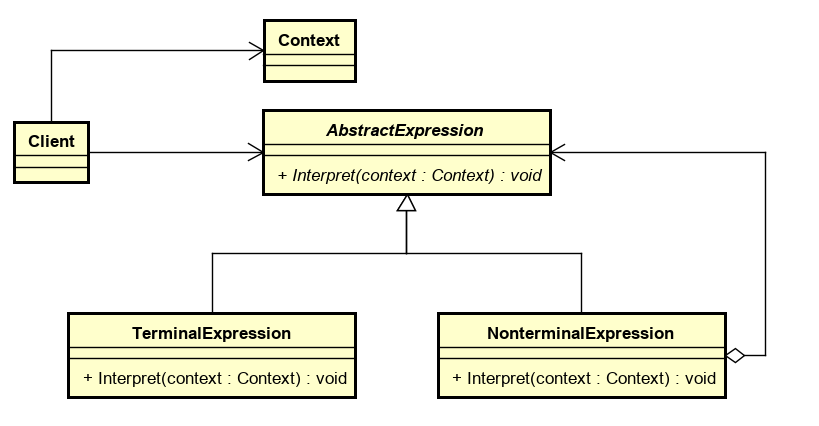
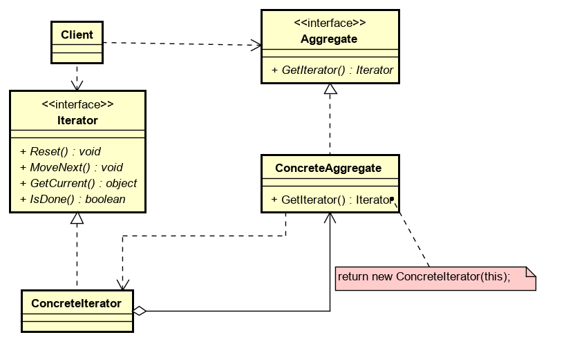

# Notebool-DesignPattern

 

[Notebook系列](https://github.com/dp9u0/Notebook)

* [Notebool-DesignPattern](#notebool-designpattern)
  * [面向对象设计原则](#%E9%9D%A2%E5%90%91%E5%AF%B9%E8%B1%A1%E8%AE%BE%E8%AE%A1%E5%8E%9F%E5%88%99)
  * [创建](#%E5%88%9B%E5%BB%BA)
    * [ABSTRACT FACTORY](#abstract-factory)
    * [BUILDER](#builder)
    * [FACTORY METHOD](#factory-method)
    * [PROTOTYPE](#prototype)
    * [SINGLETON](#singleton)
  * [结构](#%E7%BB%93%E6%9E%84)
    * [ADAPTER](#adapter)
    * [BRIDGE](#bridge)
    * [COMPOSITE](#composite)
    * [DECORATOR](#decorator)
    * [FACADE](#facade)
    * [FLYWEIGHT](#flyweight)
    * [PROXY](#proxy)
  * [行为](#%E8%A1%8C%E4%B8%BA)
    * [CHAIN OF RESPONSIBILITY](#chain-of-responsibility)
    * [COMMAND](#command)
    * [INTERPRETER](#interpreter)
    * [ITERATOR](#iterator)
    * [MEDIATOR](#mediator)
    * [MEMENTO](#memento)
    * [OBSERVER](#observer)
    * [STATE](#state)
    * [STRATEGY](#strategy)
    * [TEMPLATE METHOD](#template-method)
    * [VISITOR](#visitor)

## 面向对象设计原则

1. 开闭原则(`Open Close Principle`) : 对扩展开放,对修改关闭.增加功能时,不能去修改原有的代码,而是要扩展原有代码.
2. 职责单一原则(`Single responsibility principle`) : 每个类应该只负责一个职责,否则就应该拆分该类.
3. 里氏替换原则(`Liskov Substitution Principle`) : 任何基类可以出现的地方,子类一定可以出现. LSP是继承复用的基石,只有当衍生类可以替换掉基类,软件单位的功能不受到影响时,基类才能真正被复用,而衍生类也能够在基类的基础上增加新的行为.里氏代换原则是对开闭原则的补充.实现开闭原则的关键步骤就是抽象化.而基类与子类的继承关系就是抽象化的具体实现,所以里氏代换原则是对实现抽象化的具体步骤的规范.
4. 依赖倒转原则(`Dependence Inversion Principle`) : 依赖于抽象而不依赖于具体.
5. 接口隔离原则(`Interface Segregation Principle`) : 客户端不应该依赖它不需要的接口,一个类对另一个类的依赖应该建立在最小的接口上.
6. 迪米特原则(`Demeter Principle`) : 又称为最少知道原则,一个类对自己依赖的类知道的越少越好.无论被依赖的类多么复杂,都应该将这些复杂的逻辑封装在其内部,提供给外部的仅仅是极少的接口或者方法.这样当被依赖的类变化时,才能最小的影响该类.
7. 合成复用原则(`Composite Reuse Principle`) : 多使用组合,少用继承. 防止继承的滥用.

## 创建

### ABSTRACT FACTORY

* 目的 : 提供一个接口,可以创建一系列对象.创建一系列对象时无需指定具体的类.
* 使用场景 : 只需要提供一系列对象给调用者而无需让调用者直到创建一系列对象的细节
* 结构
  

运行时刻创建一个 `ConcreteFactory` 类的实例,`AbstractFactory` 将产品对象的创建延迟到它的 `ConcreteFactory` 子类.

* 效果

  * 优点 : 1. 分离了具体的类 2. 保持产品一直性: 一个工厂创建一个系列产品
  * 缺点 : 不方便扩展,增加一个产品`AbstractFactory` 和所有的`ConcreteFactory` 就需要增加一个`CreateProduct`方法.(解决方案 : `AbstractFactory` 只提供一个 `Create` 方法, 通过传递参数的方式确定获取哪种类型 `Product`)

* 其他说明 : 实现`ConcreteFactory`可以通过以下两种方式

  * `Product` 可以通过 `Prototype` 模式, 只需要一个`ConcreteFactory`,`CreateProduct` 通过 `Product` 的原型复制一个出来即可.(创建 `ConcreteFactory`时,指定`Product`系列即可)

  * 也可以每个系列的 `Product` 对应一个类型的 `ConcreteFactory` (`Factory Method`)

### BUILDER

* 目的 : 复杂对象的构造过程和表示分离
* 使用场景 : 构造过程复杂,并且希望通过可选的步骤一步步构造构造可以具有不同的表示的实例.
* 结构

`Client` 通过 调用 `Builder`实例(`_builder`) 的 `BuildPart` 方法 提供构造需要的参数,最终通过 `GetResult` 获取 `Product`

* 效果 : 明确的控制和改变对象的表示
* 其他说明 : 着重于一步步构造一个复杂对象

### FACTORY METHOD

* 目的 : 定义一个用于创建对象的接口,让子类决定实例化哪一个类
* 使用场景 : 基类中使用的一个类的实例化延迟到子类
* 结构

工厂方法指的是定义的抽象方法 `FactoryMethod` 用于获取实例

* 效果 : 为子类提供了Hook
* 其他说明 : 工厂方法其实是模版方法的一个用于构造对象的特例

### PROTOTYPE

* 目的 : 用原型实例指定创建对象的种类,并且通过拷贝这些原型创建新的对象
* 使用场景 : 要实例化的类型是运行时指定的或者避免创建工厂类或者当一个类的实例只能有几个不同状态组合中的一种时,通过克隆已有实例比使用状态手工实例化更方便
* 结构

* 效果 : 隐藏具体产品类,运行时刻增加和删除产品,以及其他的模式(原型链,Copy On Write)
* 其他说明 : 使用一个原型管理器, Clone 和 DeepClone

### SINGLETON

* 目的 : 保证一个类仅有一个实例,并提供一个访问它的全局访问点
* 使用场景 : 当类只能有一个实例而且客户可以从一个众所周知的访问点访问它时
* 结构

* 效果 : Singleton 是对全局变量的一种改进
* 其他说明 : 实现主要集中在如何初始化 instance防止多线程情况下instance被多次创建,之前比较流行但是后来被认识到并不是很合理的做法是 **双检锁技术**. 一些语言系统(C# over clr,Java),提供的 静态构造本身已经增加了线程安全机制,但依旧不是最优的(过早初始化),可以考虑使用延迟技术.

## 结构

### ADAPTER

* 目的 : 对现有不兼容接口进行转换
* 使用场景 : 已经存在的类,它的接口不符合需求
* 结构

客户端调用目标接口(`target.Operation()`),适配器实现目标接口并调用被适配对象的接口,这样通过中间对象 `Adapter` 将不兼容的接口 (`SpecificOperation`) 适配为兼容的接口(`Operation`)

* 效果 : 适配
* 其他说明 : 适配器除了对象组合方式,还可以通过类(继承)的方式实现,并且,对象组合方式对于多个 `Adaptee` 的场景比继承更适合.

### BRIDGE

* 目的 : 将抽象部分与它的实现部分分离,使它们都可以独立地变化
* 使用场景 : 不希望在抽象和它的实现部分之间有一个固定的绑定关系.例如这种情况可能是因为,在程序运行时刻实现部分应可以被选择或者切换.
* 结构

通过构造时定义 impl 将接口抽象部分(`Abstartion`)和实现(`Implementor`)分离.

* 效果 : 分离接口及其实现部分 提高可扩充性 实现细节对Client 透明
* 其他说明 : 可以使用 Abstrator Factory 模式来创建和配置一个特定的 Implementor.

### COMPOSITE

* 目的 : 将对象组合成树形结构以表示'部分-整体'的层次结构
* 使用场景 : 表示对象的部分-整体层次结构
* 结构

* 效果 : 客户可以一致地使用组合结构和单个对象,更容易增加新的类型(派生 `Leaf`或者派生 `Composite`)
* 其他说明 : UI 架构(WPF Winform Html) 几乎都会使用 COMPOSITE 模式

### DECORATOR

* 目的 : 动态地给一个对象添加一些额外的职责
* 使用场景 : 在不影响其他对象的情况下,以动态透明的方式给单个对象添加职责 处理那些可以撤消的职责  当不能采用生成子类的方法进行扩充时
* 结构

Decorator 将请求转发给它的 Component 对象,并有可以在转发请求前后执行一些附加的动作

* 效果 : 比静态继承更灵活 避免在层次结构高层的类有太多的特征 接口的一致性
* 其他说明 : DECORATOR 与 ADAPTER 区别在于 DECORATOR 增加功能 并不提供新的接口, ADAPTER目的则是提供兼容性接口,而不在于新功能上

### FACADE

* 目的 : 为子系统中的一组接口提供一个一致的界面
* 使用场景 : 为一个复杂子系统提供一个简单接口, Client 不需要关心子系统内部的细节
* 结构

* 效果 :  FACADE模式定义了一个高层接口,这个接口使得这一子系统更加容易使用,对客户屏蔽子系统组件
* 其他说明 :

### FLYWEIGHT

* 目的 : 运用共享技术有效地支持大量细粒度的对象
* 使用场景 :  一个应用程序使用了大量的对象 对象的大多数状态都可变为外部状态 剥离外部状态可以用相对较少的共享对象取代很多组对象
* 结构

* 效果 : 节省空间
* 其他说明 : 文本编辑器绘制一个字符时,无需为每个字符绘制都创建一个对象,可以复用同一个字符,绘制时将外部状态(例如字体,大小,颜色)等提供给绘制器.

### PROXY

* 目的 : 为其他对象提供一种代理以控制对这个对象的访问
* 使用场景 : 远程代理 保护代理 虚代理(按需加载,先提供一个虚代理替代实际对象) Smart Reference
* 结构

* 效果 : 访问对象时引入了一定程度的间接性
* 其他说明 :  DECORATOR为对象添加一个或多个功能，而代理则控制对对象的访问

## 行为

### CHAIN OF RESPONSIBILITY

* 目的 : 使多个对象都有机会处理请求,从而避免请求的发送者和接收者之间的耦合关系.将这些对象连成一条链,并沿着这条链传递该请求,直到有一个对象处理它为止.
* 使用场景 :
  * 有多个的对象可以处理一个请求哪个对象处理该请求运行时刻自动确定
  * 不明确指定接收者的情况下,向多个对象中的一个提交一个请求
  * 处理请求的对象集合应被动态指定
* 结构

* 效果 : 解耦发送者和接受者
* 其他说明 : .Net 的委托是一个 CHAIN OF RESPONSIBILITY的实现 (只是传递的请求会被处理链上所有的委托处理,CHAIN OF RESPONSIBILITY 最本质特点是接收者链 和向后继者消息传递)

### COMMAND

* 目的 :
* 使用场景 : COMMAND模式是回调机制的一个面向对象的替代品
* 结构

* 效果 : 调用操作的对象(`Invoker`)与知道如何实现该操作的对象(`Receiver`)解耦
* 其他说明 : Undo Redo

### INTERPRETER

* 目的 : 用来解释语言中的句子
* 使用场景 : 解释语言
* 结构

* 效果 : 易于改变和扩展文法
* 其他说明 :

### ITERATOR

* 目的 : 提供一种方法顺序访问一个聚合对象中各个元素 而又不需暴露该对象的内部表示
* 使用场景 : 访问内容(统一访问接口)
* 结构

* 效果 : 遍历内容 统一接口 在同一个聚合上可以有多个遍历
* 其他说明 : 为了支持多个遍历 每次获取 Iterator 都返回新的 Iterator, Iterator 负责维护访问状态(currentIndex)等

### MEDIATOR

* 目的 : 用一个中介对象来封装一系列的对象**交互**(双向的)
* 使用场景 : 一组对象以定义良好但是复杂的方式进行通信 此时可以通过中介负责提供统一交互
* 结构

* 效果 : 对象解耦 中介难以维护
* 其他说明 : 类似于一个数据总线的东西 所有对象之间的交互都通过中介进行. Colleague 通过 Observer模式与 Mediator 通信

### MEMENTO

* 目的 : 在不破坏封装性的前提下,捕获一个对象的内部状态,并在该对象之外保存这个状态.这样以后就可将该对象恢复到原先保存的状态
* 使用场景 : 状态保存和恢复
* 结构

* 效果 : 保持封装边界 开销
* 其他说明 : Caretaker 负责管理 从 `Originator` 获取 `Memento`, 管理 `Memento` , 通过 `Memento` 恢复 `Originator` 的状态

### OBSERVER

* 目的 : 定义对象间的一种一对多的依赖关系,当一个对象的状态发生改变时,所有依赖于它的对象都得到通知并被自动更新
* 使用场景 : 订阅发布 发布者和订阅者解耦
* 结构

* 效果 : 目标和观察者间的抽象耦合
* 其他说明 :

### STATE

* 目的 : 允许一个对象在其内部状态改变时改变它的行为
* 使用场景 : 一个对象的行为取决于它的状态 一个操作中含有庞大的多分支的条件语句
* 结构

* 效果 : 将不同状态的行为分割开来
* 其他说明 :

### STRATEGY

* 目的 : 算法可独立于使用它的客户而变化
* 使用场景 : 使用不同算法
* 结构

* 效果 : 相关算法系列 消除条件语句
* 其他说明 :

### TEMPLATE METHOD

* 目的 : 定义一个操作中的算法的骨架,而将一些步骤延迟到子类中
* 使用场景 : 一次性实现一个算法的不变的部分,并将可变的行为留给子类来实现 (Hook)
* 结构

* 效果 : 提取了类库中的公共行为
* 其他说明 : 模板方法导致一种反向的控制结构,这种结构有时被称为"好莱坞法则",即"别找我们,我们找你"

### VISITOR

* 目的 :
* 使用场景 :
* 结构

* 效果 :
* 其他说明 :
